<p align="right">
  <strong>🌐 Language / Мова:</strong> <a href="README.md">Українська</a> | <b>English</b>
</p>

# WordsTelegramStats 📊 🧠 💬

<p align="center">
  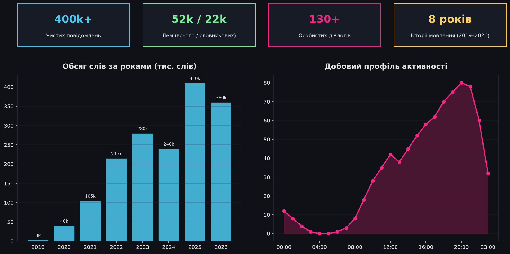
</p>

<p align="center">
  
  
  
  
  
</p>

---

## 📖 About the Project

**WordsTelegramStats** is an autonomous system for deep corpus linguistic and stylometric analysis of your Telegram chat history across all years. An advanced personal **"Telegram Wrapped"** featuring an interactive dark-themed Web UI and generating **over 30 detailed analytical infographics**.

The system analyzes **exclusively your own outgoing messages** (`from_user = me`) from private chats (excluding channels, groups, and bots), cleans text of quotes and forwards, performs morphological lemmatization (`pymorphy3`), benchmarks your style against natural language norms on the Zipf scale (`wordfreq`), and reconstructs sleep cycles, vocabulary evolution, and social relationships.

---

## ✨ Key Features

* 🔒 **100% Local & Private**: All messages, session tokens, and SQLite databases remain solely on your device. Zero external data collection or telemetry.
* 📲 **One-Click QR Authorization**: Sign in via the official Telegram Desktop client credentials (`API ID 2040`) directly in your browser or terminal — no need to create an application on `my.telegram.org`.
* 👥 **Focus on Genuine Speech**: Automatic filtering of forwarded messages, URLs, copypastes, and "Saved Messages".
* ⚡ **Incremental Synchronization**: Downloads only new messages sent since the last run.
* 🧬 **Morphological Lemmatization (`pymorphy3`)**: Normalizes words to base dictionary forms (UA/RU/EN) while preserving slang, neologisms, and textual laughter variants.
* 📚 **Corpus Linguistics (`wordfreq`)**: Computes frequency shifts (identifying signature words), validates Zipf's and Heaps' laws, and evaluates lexical richness (TTR).
* 🌙 **Biorythms & Sleep Reconstruction**: Automatically estimates bedtime, wake-up time, and sleep duration based on night-time chat inactivity intervals.
* 🌐 **Modern Web UI + CLI**: Responsive web dashboard with real-time logs (SSE), interactive chart gallery with modal zoom, and a rich CLI toolkit.
* 🐳 **Docker-Ready**: Full stack spins up with a single command: `docker-compose up -d --build`.

---

## 🖼️ Infographics Showcase

All charts are rendered automatically in a signature dark theme (`#0f1117`) using DejaVu Sans vector fonts and a vibrant neon palette. Below are examples of the generated analytics:

### 1. Lexical Core & Word Cloud
Lemmatized semantic core of the author's corpus with grammatical stop words and particles filtered out:

<p align="center">
  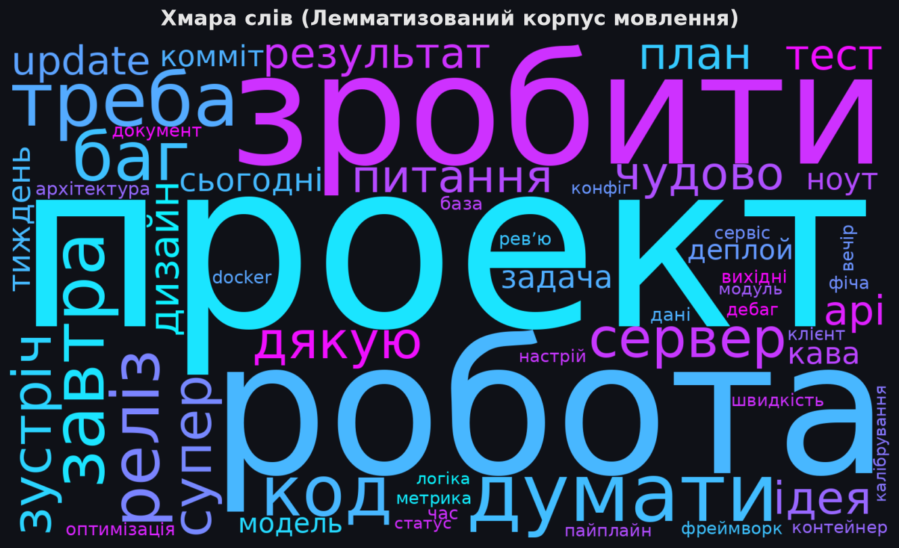
</p>

---

### 2. Temporal Rhythms, Activity & Sleep Evolution

#### 🕒 Activity Heatmap (Day of Week × Hour of Day)
Hourly overview of daily peak chatting times and weekend schedule shifts:
<p align="center">
  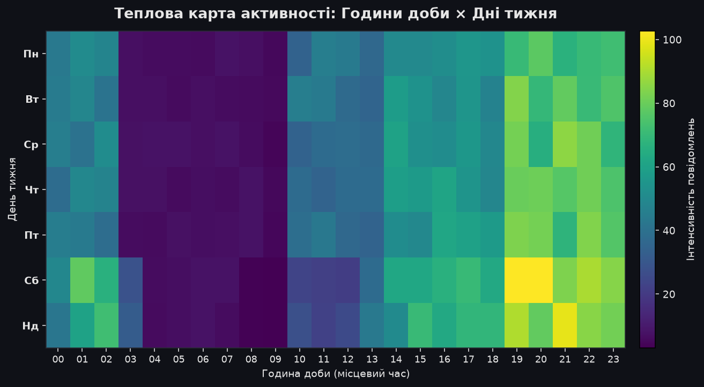
</p>

#### 🌙 Sleep Schedule Reconstruction Over Years
Automatic detection of bedtime, morning wake-up times, and average sleep duration from nocturnal silence intervals:
<p align="center">
  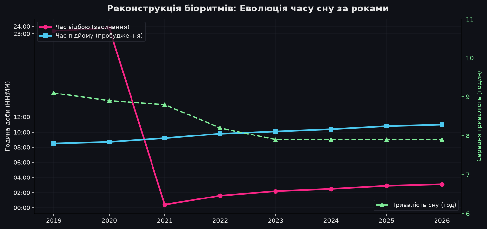
</p>

#### 📈 Monthly Messaging Timeline (2019–2026)
Dynamics of message dispatch volume broken down by month across the entire account history:
<p align="center">
  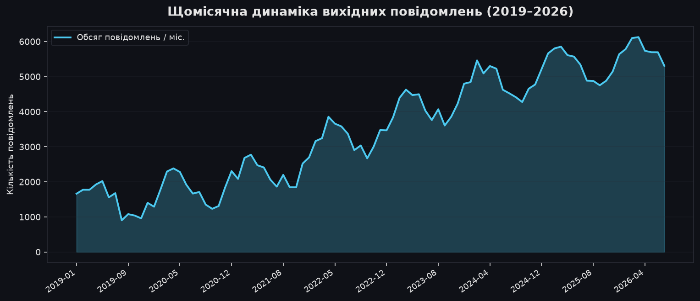
</p>

---

### 3. Linguistics, Morphology & Vocabulary

#### 📚 Honest Vocabulary Growth (Heaps' Law)
Two-tier evaluation model: comparing raw lemma count (including typos) against confirmed active lexicon (used $\ge 2$ times) and verified dictionary words:
<p align="center">
  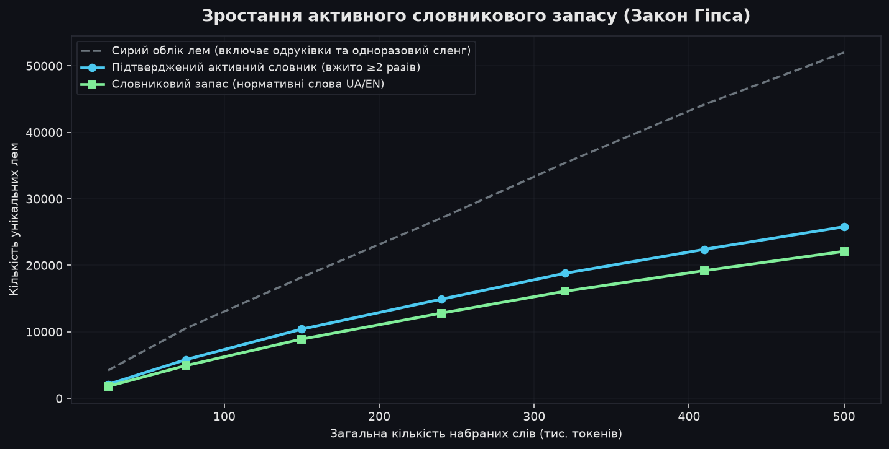
</p>

#### 😂 Laughter Style Evolution (*haha* → *hpxvx* → *hehe*)
Stylistic shifts in emotional expression and textual laughter patterns over the years:
<p align="center">
  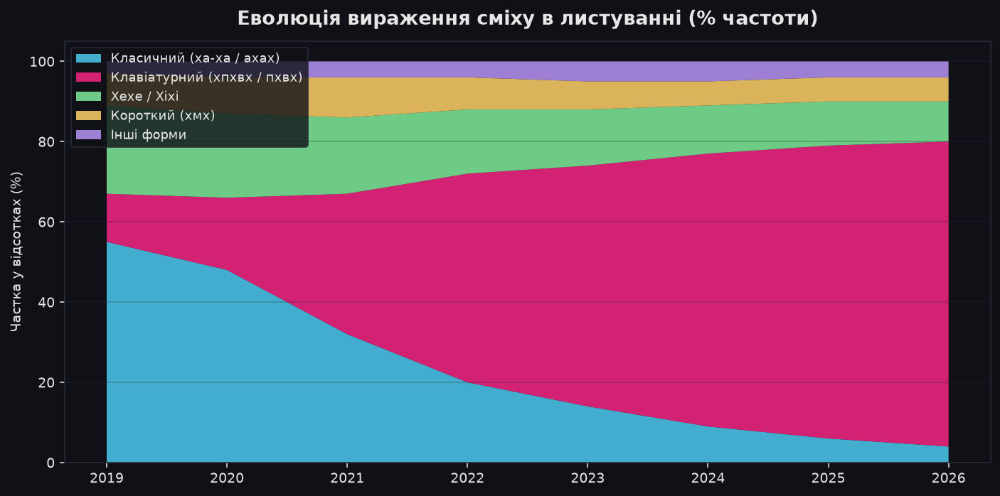
</p>

#### 🏷️ Morphological Profile (Parts of Speech)
Evolution of balance between verbs (action), nouns (entities), adjectives (descriptions), and adverbs:
<p align="center">
  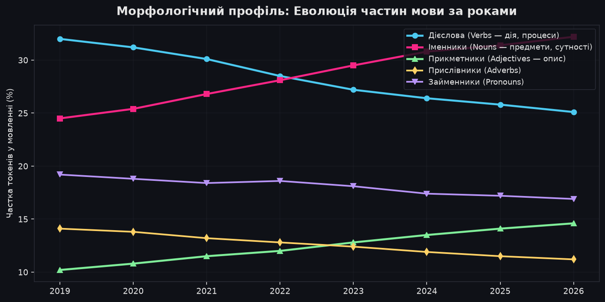
</p>

#### 💬 Signature N-grams & Collocations
Ranking of the most frequent bigrams (2 words) and trigrams (3 words) shaping individual speech patterns:
<p align="center">
  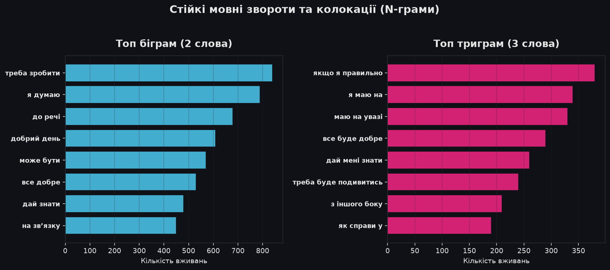
</p>

#### 📐 Zipf's Law (Rank-Frequency Distribution)
Logarithmic validation of empirical word distribution against Zipf's fundamental linguistic law ($s \approx -1.0$):
<p align="center">
  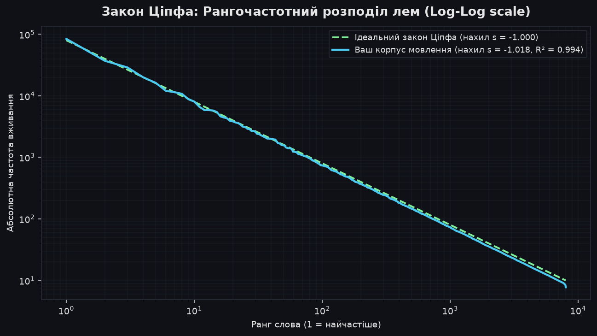
</p>

---

### 4. Relationships, Social Dynamics & Clustering

#### 🌊 Social Attention Streamgraph
Redistribution of time and message volume across key contacts and social circles over the years:
<p align="center">
  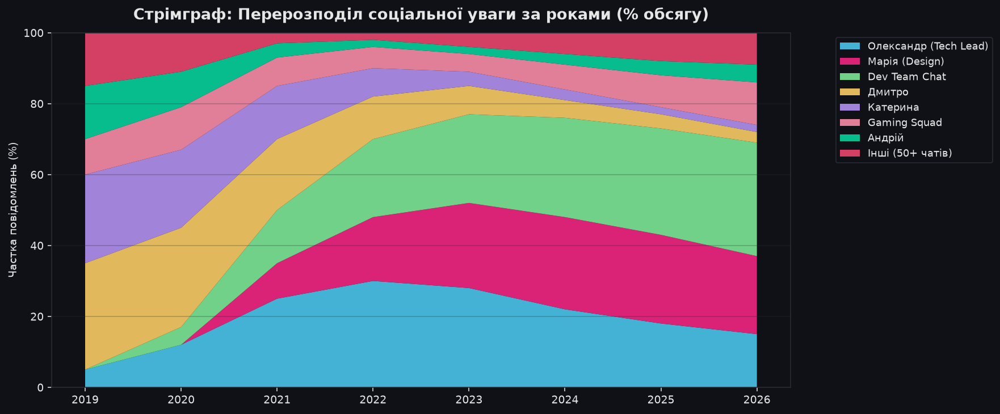
</p>

#### 🔍 Chat Fingerprints (TF-IDF)
Distinctive lexical markers and characteristic words used almost exclusively with specific contacts:
<p align="center">
  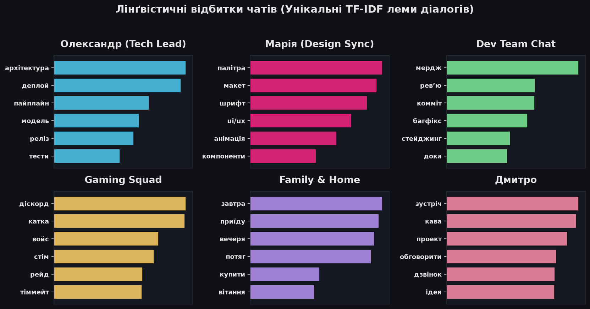
</p>

#### ⏳ Relationship Lifecycles & Dialogues
Intensity heatmap: when dialogues emerged, peaked in activity, or faded:
<p align="center">
  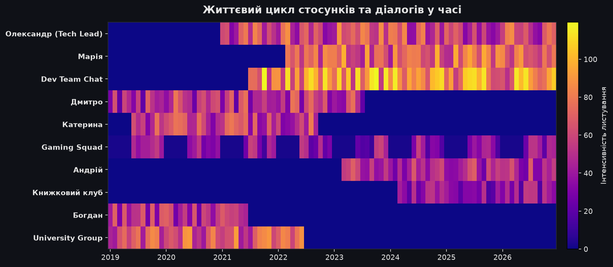
</p>

#### 🌳 Speech Style Clustering (Dendrogram)
Hierarchical clustering of interlocutors based on similarity in vocabulary and lexical tone:
<p align="center">
  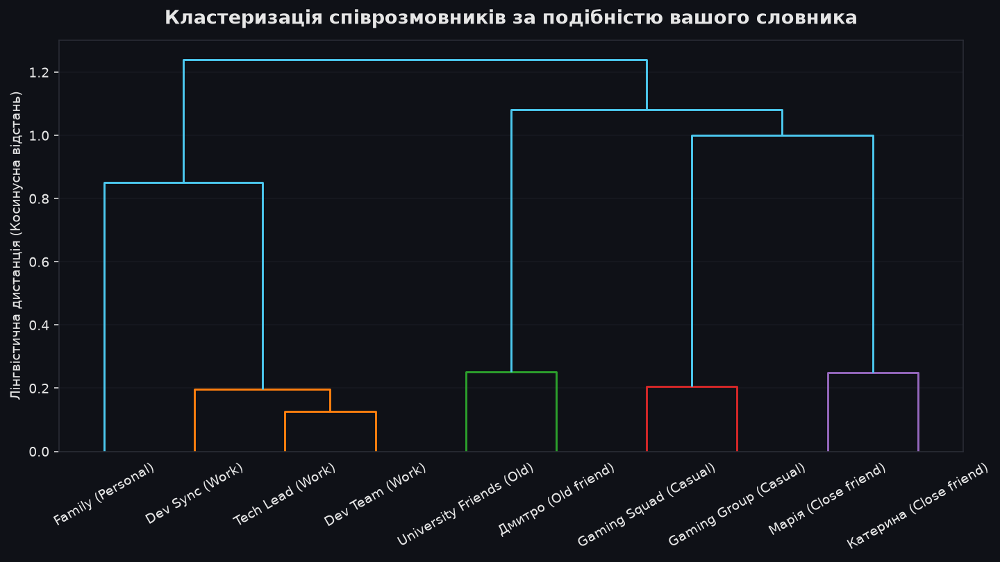
</p>

---

## 🚀 Quick Start

### Option 1: Docker (Recommended)

1. Clone the repository and navigate into the project directory:
   ```bash
   git clone https://github.com/yourusername/WordsTelegramStats.git
   cd WordsTelegramStats
   ```

2. Start the container:
   ```bash
   docker-compose up -d --build
   ```

3. Open in your browser: **`http://localhost:8000`**
   * Click **"Login via QR"** and scan the QR code with your Telegram mobile client (*Settings → Devices → Link Desktop Device*).
   * Click **"Sync Messages"** to fetch chat history.
   * Click **"Run Full Pipeline"** to generate all statistics and infographics.

---

### Option 2: Local Setup (Python)

1. **Install dependencies**:
   ```bash
   python -m venv .venv
   source .venv/bin/activate  # Windows: .venv\Scripts\activate
   pip install -r requirements.txt
   ```

2. **Run via unified CLI `main.py`**:
   ```bash
   python main.py              # Launch local Web UI (http://localhost:8000)
   python main.py fetch        # Fetch/sync messages (QR in terminal)
   python main.py analyze      # Run linguistic analysis and generate text report
   python main.py infographics # Build all infographic charts
   python main.py pipeline     # Run complete cycle (analysis + infographics)
   ```

3. **Run specific standalone scripts from `scripts/`**:
   * `python scripts/fetch_messages.py` — message fetcher via terminal with QR authorization.
   * `python scripts/analyze_texts.py` — frequency word lists and console report `advanced_report.txt`.
   * `python scripts/generate_infographics.py` — generate all charts in `infographics/`.
   * `python scripts/sleep_schedule.py` — calculate sleep schedule `sleep_evolution.png`.
   * `python scripts/validate_vocab.py` — linguistic vocabulary audit.
   * `python scripts/core_vocabulary.py` — stable core vocabulary analysis.
   * `python scripts/generate_sample_assets.py` — generate anonymized demo charts for presentation.

---

## 📊 Full Infographics Catalog

| Category | File | Description & Metrics |
| :--- | :--- | :--- |
| **Summary & Core** | `dashboard.png` | Main overview dashboard with key KPIs |
| | `wordcloud.png` | Word cloud of the most frequent meaningful lemmas |
| **Time & Biorythms** | `timeline_monthly.png` | Message volume month by month (2019–2026) |
| | `activity_heatmap.png` | Heatmap: hour of day × day of week |
| | `activity_by_hour.png` | 24-hour daily dispatch profile |
| | `activity_by_weekday.png` | Activity by day of week (weekdays vs weekends) |
| | `active_days.png` | Calendar of active days and consecutive streaks |
| | `seasonality.png` | Seasonal fluctuations by month of year |
| | `night_trend.png` | Share of night messages (00:00–06:00) by year |
| | `sleep_evolution.png` | Reconstruction of bedtime, wake-up time, and sleep duration |
| | `message_rhythm.png` | Message intervals and burstiness ratio |
| **Stylometry & Language** | `core_vocabulary.png` | Core stable vocabulary used year over year (heatmap) |
| | `signature_words.png` | Signature words vs natural language baseline |
| | `vocab_timeline.png` | Cumulative vocabulary growth (verified vs dictionary lemmas) |
| | `vocab_validation.png` | Lexical breakdown (standard words, slang, typos) |
| | `ngrams.png` | Top bigrams and trigrams (collocations and phrases) |
| | `pos_evolution.png` | Parts of speech balance (verbs, nouns, adjectives, adverbs) |
| | `laughter_evolution.png` | Evolution of textual laughter (*haha*, *hehe*, *hpxvx*, *pxvx*) |
| | `profanity_trend.png` | Strong language usage rate per 1,000 words over time |
| | `questions_exclamations.png`| Dynamics of question and exclamation marks |
| | `language_mix.png` | Language proportions (UA / RU / EN) |
| | `zipf_law.png` | Zipf's law validation (rank-frequency slope) |
| | `msg_length_dist.png` | Message length distribution (histogram & median word count) |
| | `word_length_distribution.png` | Word length distribution by character count |
| **Relationships & Chats** | `top_chats.png` | Top dialogues by total message volume |
| | `streamgraph_chats.png` | Streamgraph of attention redistribution across contacts |
| | `relationships_timeline.png`| Lifecycles and active periods of dialogues |
| | `chat_fingerprint.png` | Distinctive TF-IDF keywords unique to each dialogue |
| | `speech_clustering.png` | Dendrogram of conversational style similarity |
| | `speech_similarity_matrix.png` | Heatmap of pairwise vocabulary cosine similarity |
| | `social_breadth.png` | Social breadth: active monthly contacts count |
| | `ty_vy.png` | Balance of informal vs formal addressing (Ty / Vy) |
| | `mat_per_chat.png` | Distribution of profanity across specific chats |

---

## 🔬 Scientific Methodology

### 1. Filtering Non-Author Speech
To ensure stylometric purity, the pipeline isolates genuine authorial voice:
* Discards all forwarded messages (`is_forwarded == True`).
* Strips external URLs, links, and technical artifacts.
* Excludes long copypastes and quotes (>600 characters or >100 words).

### 2. Honest Vocabulary Estimation
In informal messaging, up to 40–50% of unique tokens are typos or one-off neologisms. Naive `set(words)` counts artificially double true lexicon size. **WordsTelegramStats** applies a two-tier validation model:
1. **Confirmed Active Vocabulary**: lemmas appearing at least $\ge 2$ times.
2. **Standard Vocabulary**: lemmas verified against normative linguistic corpora (`pymorphy3` + `wordfreq`).

### 3. Sleep Reconstruction via Silence Intervals
The algorithm inspects the nocturnal window from 20:00 to 14:00 the following day and identifies the **longest unbroken gap with zero outgoing messages**. The beginning marks estimated bedtime, the end marks wake-up time, and the duration represents estimated sleep duration.

---

## 📁 Repository Structure

```text
WordsTelegramStats/
│
├── src/                         # Core source code package
│   ├── core/                    # Configuration, paths, color themes
│   ├── data/                    # SQLite database handling (chats_data/*.db)
│   ├── nlp/                     # pymorphy3 lemmatization, language/profanity/laughter detectors
│   ├── analytics/               # Statistical analytics, TTR, sleep, TF-IDF, N-grams
│   ├── visualization/           # Chart renderers (basic, behavioral, linguistic, social)
│   ├── telegram/                # Telethon client, QR authorization, message fetcher
│   ├── pipeline/                # Main pipeline orchestrator
│   └── web/                     # FastAPI backend & dark Web UI (HTML/CSS/JS)
│
├── scripts/                     # CLI scripts & standalone utilities
│   ├── fetch_messages.py        # Telegram message downloader
│   ├── analyze_texts.py         # Text analytics & advanced_report.txt
│   ├── generate_infographics.py # Chart generation into infographics/
│   ├── sleep_schedule.py        # Sleep schedule analysis
│   ├── core_vocabulary.py       # Core persistent vocabulary analysis
│   ├── validate_vocab.py        # Linguistic vocabulary validation
│   └── generate_sample_assets.py# Demo chart generator for presentations
│
├── chats_data/                  # Local SQLite databases per chat (.db)
├── session/                     # Telegram session authorization file (.session)
├── infographics/                # High-resolution generated charts (.png)
├── words_lists/                 # Frequency wordlists by chat and year (.txt)
├── docs/images/                 # Anonymized sample infographics for README
├── docker-compose.yml           # Docker Compose orchestration file
├── Dockerfile                   # Container definition
└── main.py                      # Unified CLI and Web UI entrypoint
```

---

## 🔒 Privacy & Security

* Authorization occurs directly with Telegram servers using the official MTProto protocol.
* Session files in `session/` and databases in `chats_data/` are listed in `.gitignore` and never leave your local machine.
* By default, the web interface listens exclusively on the local socket `localhost:8000`.

---

## 📄 License

Distributed under the [MIT](LICENSE) open-source license.
